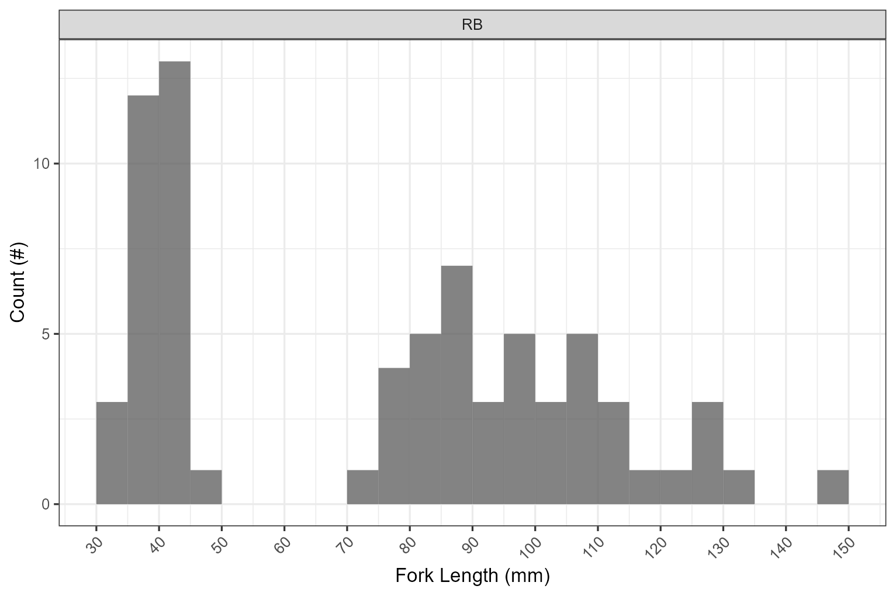

# Results and Discussion

`r if(gitbook_on)knitr::asis_output("Results of Phase 1 and Phase 2 assessments are summarized in Figure \\@ref(fig:map-interactive) with additional details provided in sections below.")` 

<br>

```{r map-interactive, eval=gitbook_on, fig.cap='Map of fish passage and habitat confirmation results', eval=gitbook_on}
##make colors for the priorities
pal <- 
   colorFactor(palette = c("red", "yellow", "grey", "black"), 
               levels = c("high", "moderate", "low", "no fix"))

pal_phase1 <- 
   colorFactor(palette = c("red", "yellow", "grey", "black"), 
               levels = c("high", "moderate", "low", NA))

# tab_map_phase2 <- tab_map %>% dplyr::filter(source %like% 'phase2')
#https://stackoverflow.com/questions/61026700/bring-a-group-of-markers-to-front-in-leaflet
# marker_options <- markerOptions(  
#   zIndexOffset = 1000)
tracks <- sf::read_sf("./data/habitat_confirmation_tracks.gpx", layer = "tracks")


wshd_study_areas <- sf::read_sf('data/fishpass_mapping/wshd_study_areas.geojson')
  # st_transform(crs = 4326)

  
map <- leaflet(height=500, width=780) %>%
  addTiles()  %>% 
  # leafem::addMouseCoordinates(proj4 = 26911) %>% ##can't seem to get it to render utms yet
  # addProviderTiles(providers$"Esri.DeLorme") %>% 
  addProviderTiles("Esri.WorldTopoMap", group = "Topo") %>%
  addProviderTiles("Esri.WorldImagery", group = "ESRI Aerial") %>% 
  addPolygons(data = wshd_study_areas |> dplyr::filter(watershed_group_code != 'NATR'), color = "#F29A6E", weight = 1, smoothFactor = 0.5,
              opacity = 1.0, fillOpacity = 0,
              fillColor = "#F29A6E", label = wshd_study_areas$watershed_group_name) %>%
  addPolygons(data = wshds, color = "#0859C6", weight = 1, smoothFactor = 0.5,
              opacity = 1.0, fillOpacity = 0.25,
              fillColor = "#00DBFF",
              label = wshds$stream_crossing_id,
              popup = leafpop::popupTable(x = select(wshds %>% st_set_geometry(NULL),
                                                     Site = stream_crossing_id,
                                                     elev_site:area_km),
                                          feature.id = F,
                                          row.numbers = F),
              group = "Phase 2") %>% 
  addLegend(
    position = "topright",
    colors = c("red", "yellow", "grey", "black"),
    labels = c("High", "Moderate", "Low", 'No fix'), opacity = 1,
    title = "Fish Passage Priorities") %>% 
  
addCircleMarkers(data=tab_map %>%
                   dplyr::filter(source %like% 'phase1' | source %like% 'pscis_reassessments'),
                 label = tab_map %>% dplyr::filter(source %like% 'phase1' | source %like% 'pscis_reassessments') %>% pull(pscis_crossing_id),
                 # label = tab_map$pscis_crossing_id,
                 labelOptions = labelOptions(noHide = F, textOnly = TRUE),
                 popup = leafpop::popupTable(x = select((tab_map %>% st_set_geometry(NULL) %>% dplyr::filter(source %like% 'phase1' | source %like% 'pscis_reassessments')),
                                                        Site = pscis_crossing_id, Priority = priority_phase1, Stream = stream_name, Road = road_name, `Habitat value`= habitat_value, `Barrier Result` = barrier_result, `Culvert data` = data_link, `Culvert photos` = photo_link, `Model data` = model_link),
                                             feature.id = F,
                                             row.numbers = F),
                 radius = 9,
                 fillColor = ~pal_phase1(priority_phase1),
                 color= "#ffffff",
                 stroke = TRUE,
                 fillOpacity = 1.0,
                 weight = 2,
                 opacity = 1.0,
                 group = "Phase 1") %>% 
  addPolylines(data=tracks,
               opacity=0.75, color = '#e216c4',
               fillOpacity = 0.75, weight=5, group = "Phase 2") %>%

addAwesomeMarkers(
    lng = as.numeric(photo_metadata$gps_longitude),
    lat = as.numeric(photo_metadata$gps_latitude),
    popup = leafpop::popupImage(photo_metadata$url, src = "remote"),
    clusterOptions = markerClusterOptions(),
    group = "Phase 2") %>%

  #commented out this section for now until tab_hab_map object is built from cost estimate table
  addCircleMarkers(
    data=tab_hab_map,
    label = tab_hab_map$pscis_crossing_id,
    labelOptions = labelOptions(noHide = T, textOnly = TRUE),
    popup = leafpop::popupTable(x = select((tab_hab_map %>% st_drop_geometry()),
                                           Site = pscis_crossing_id,
                                           Priority = priority,
                                           Stream = stream_name,
                                           Road = road_name,
                                           `Habitat (m)`= upstream_habitat_length_m,
                                           Comments = comments,
                                           `Culvert data` = data_link,
                                           `Culvert photos` = photo_link,
                                           `Model data` = model_link),
                                feature.id = F,
                                row.numbers = F),
    radius = 9,
    fillColor = ~pal(priority),
    color= "#ffffff",
    stroke = TRUE,
    fillOpacity = 1.0,
    weight = 2,
    opacity = 1.0,
    group = "Phase 2"
    ) %>%

  addLayersControl(
    baseGroups = c(
      "Esri.DeLorme",
      "ESRI Aerial"),
    overlayGroups = c("Phase 1", "Phase 2"),
    options = layersControlOptions(collapsed = F)) %>%
  leaflet.extras::addFullscreenControl() %>%
  addMiniMap(tiles = providers$"Esri.NatGeoWorldMap",
             zoomLevelOffset = -6, width = 100, height = 100)

map %>% 
  hideGroup(c("Phase 2"))
```

## Communicate Connectivity Issues

We conducted an online presentation through FWCP to showcase the project on February 23, 2024 with over 70 people in 
attendance. A presentation to FWCP Peace board detailing project progress, goals and budgets was also completed on February 6, 2024.

SERNbc and McLeod Lake have been actively engaging with the following groups through numerous meetings, emails and phone
calls to build awareness for the initiative, solicit input, prioritize sites, raise partnership funding and plan/implement 
fish passage remediations: 

  * McLeod Lake Indian Band members of council
  * BCTS Engineering
  * CN Rail
  * Canadian Forest Products (Canfor)
  * Sinclar Forest Projects Ltd. (Sinclar)
  * Northern Engineering - Ministry of Forests
  * BC Ministry of Transportation and Infrastructure
  * Fish Passage Technical Working Group
  * Coastal Gaslink
  * British Columbia Wildlife Federation
  * Planning foresters and biologists from Ministry of Forests and Ministry of Land, Water and Resource Stewardship
  * Fisheries experts
  * University of Northern BC

### Collaborative GIS Environment

A summary of background information spatial layers and tables loaded to the collaborative GIS project (`r params$gis_project_name`) at the
time of writing (`r format(lubridate::now(), "%Y-%m-%d")`) are included in Table \@ref(tab:tab-rfp-tracking).

```{r rfp-metadata, eval = gis_update}
# grab the metadata
md <- rfp::rfp_meta_bcd_xref()

# burn locally so we don't nee to wait for it
md %>% 
  readr::write_csv("data/rfp_metadata.csv")
```


```{r rfp-tracking-copy, eval = TRUE}

md_raw <- readr::read_csv("data/rfp_metadata.csv")

md <- dplyr::bind_rows(
  md_raw,
  rfp::rfp_xref_layers_custom
) 
                    
# first we will copy the doc from the Q project to this repo - the location of the Q project is outside of the repo!!
q_path_stub <- "~/Projects/gis/sern_peace_fwcp_2023/"

# this is differnet than Neexdzii Kwa as it lists layers vs tracking file (tracking file is newer than this project).  
# could revert really easily to the tracking file if we wanted to.
gis_layers_ls <- sf::st_layers(paste0(q_path_stub, "background_layers.gpkg")) 

gis_layers <- tibble::tibble(content = gis_layers_ls[["name"]])
   
# remove the `_vw` from the end of content
rfp_tracking_prep <- dplyr::left_join(
  gis_layers |> 
    dplyr::distinct(content, .keep_all = FALSE),
  
  md |> 
    dplyr::select(content = object_name, url = url_browser, description),
  
  by = "content"
) |> 
  dplyr::arrange(content)

rfp_tracking_prep |> 
  readr::write_csv("data/rfp_tracking_prep.csv")

```

```{r tab-rfp-tracking}
rfp_tracking_prep <- readr::read_csv(
  "data/rfp_tracking_prep.csv"
) 

rfp_tracking_prep %>% 
  fpr::fpr_kable(caption_text = "Layers loaded to collaborative GIS project.",
                 footnote_text = "Metadata information for bcfishpass and bcfishobs layers can be provided here in the future but  currently can usually be sourced from https://smnorris.github.io/bcfishpass/06_data_dictionary.html .",
                 scroll = gitbook_on)


```


```{r field-planning-prep, eval = FALSE}

### Interactive Dashboard {-}

# `r if(gitbook_on){knitr::asis_output("The interactive dashboard is presented in Figure \\@ref(fig:widget-planning-caption).")}else knitr::asis_output("An interactive dashboard to facilitate planning to facilitate planning within the Parsnip River, Carp River, Crooked River and Naton River watershed groups is located within the online interactive version of the report located at https://newgraphenvironment.github.io/fish_passage_peace_2023_reporting/.")` 

# we have some dams that we want to exclude in this query
dams <- c('785afb41-dfdf-423c-a291-e213d4b44f26',
          '320902cd-48fc-40e5-8c0f-191086f332aa',
          '957546a9-e6c7-46bf-947a-b17d8a818d71')
# join bcfishpass to some pscis columns for the screening table
# get our dataframe to link to a map
# xings filtered by >1km of potential rearing habitat
xf <- left_join(
  bcfishpass %>% 
    fpr::fpr_sp_assign_sf_from_utm(col_easting = "utm_easting", col_northing = "utm_northing") %>%
    # st_as_sf(coords = c('utm_easting', 'utm_northing'), crs = 26910, remove = F) %>% 
    dplyr::filter(is.na(pscis_status) | (pscis_status != 'HABITAT CONFIRMATION' &
                                    barrier_status != 'PASSABLE' &
                                    barrier_status != 'UNKNOWN')) %>% 
    dplyr::filter(bt_rearing_km > 0.499) %>%
    dplyr::filter(crossing_type_code != 'OBS') %>% 
    dplyr::filter(is.na(barriers_anthropogenic_dnstr) |
         str_detect(barriers_anthropogenic_dnstr, paste(dams, collapse = "|"))) |> 
    # rename(bt_rearing_km_raw = bt_rearing_km) %>%
    # mutate(bt_rearing_km = case_when(
    #   bt_rearing_km_raw >= 1 & bt_rearing_km_raw < 2 ~ '1-2km',
    #   bt_rearing_km_raw >= 2 & bt_rearing_km_raw <= 5 ~ '2-5km',
    #   bt_rearing_km_raw >= 5 & bt_rearing_km_raw <= 10 ~ '5-10km',
    #   T ~ '>10km')
    # ) %>%
    # mutate(bt_rearing_km = factor(bt_rearing_km, levels = c('1-2km', '2-5km', '5-10km', '>10km'))) %>%
    select(id = aggregated_crossings_id, 
           pscis_status, 
           barrier_status, 
           contains('bt_'), 
           utm_easting,
           utm_northing,
           gradient_gis = gradient,
           mapsheet = dbm_mof_50k_grid,
           watershed_group_code) %>% 
    # need to run rowise for our fpr function to hit each row
    mutate(map_link = paste0('https://hillcrestgeo.ca/outgoing/fishpassage/projects/parsnip/archive/2022-05-27/FishPassage_', mapsheet, '.pdf')) %>% 
    mutate(map_link = paste0("<a href ='", map_link,"'target='_blank'>", map_link,"</a>")) %>% 
    arrange(id) %>% 
    st_transform(crs = 4326),
  
  pscis_assessment_svw %>% 
    mutate(stream_crossing_id = as.character(stream_crossing_id)) %>% 
    select(
      stream_crossing_id, 
      stream_name, 
      road_name, 
      outlet_drop,
      channel_width = downstream_channel_width,
      habitat_value_code,
      image_view_url,
      assessment_comment) %>% 
    mutate(image_view_url = paste0("<a href ='", image_view_url,"'target='_blank'>",image_view_url,"</a>")) %>% 
    st_drop_geometry(),
  
  by = c('id' = 'stream_crossing_id')) %>% 
  select(id,
         stream_name,
         habitat_value = habitat_value_code,
         mapsheet,
         map_link,
         image_view_url,
         pscis_status:bt_slopeclass15_km, 
         bt_spawning_km:gradient_gis,
         # bt_spawning_km,
         # bt_rearing_km_raw:gradient_gis,
         road_name:assessment_comment,
         watershed_group_code)
  # dplyr::relocate(assessment_comment, .after = last_col())
  
  
  

# xf %>%
#   dplyr::filter(!is.na(pscis_status))
# 
# t <- xf %>%
#   group_by(bt_rearing_km) %>%
#   summarise(n = n())

```

```{r widget-planning, eval = FALSE}
# Wrap data frame in SharedData
sd <- crosstalk::SharedData$new(xf %>% dplyr::select(-mapsheet))


# Use SharedData like a dataframe with Crosstalk-enabled widgets
map <- sd %>% 
  
  leaflet(height=500) %>% #height=500, width=780
  # addTiles() %>% 
  addProviderTiles("Esri.WorldTopoMap", group = "Topo") %>%
  
  addProviderTiles("Esri.WorldImagery", group = "ESRI Aerial") %>% 
  
  addCircleMarkers(
    label = xf$id,
    labelOptions = labelOptions(noHide = T, textOnly = TRUE),
    popup = leafpop::popupTable(xf %>% 
                                  st_drop_geometry() %>% 
                                  select(id, 
                                         stream_name,
                                         bt_rearing_km,
                                         # bt_rearing_km = bt_rearing_km_raw,
                                         bt_spawning_km,
                                         mapsheet,
                                         image_view_url, 
                                         assessment_comment,
                                         watershed_group_code),
                                feature.id = F,
                                row.numbers = F),
    radius = 9,
    fillColor = "red",
    color= "#ffffff",
    stroke = TRUE,
    fillOpacity = 1.0,
    weight = 2,
    opacity = 1.0
  ) %>% 
  leaflet::addPolygons(data = wshd_study_areas, color = "#F29A6E", weight = 1, smoothFactor = 0.5,
              opacity = 1.0, fillOpacity = 0,
              fillColor = "#F29A6E", label = wshd_study_areas$watershed_group_name) %>% 
  leaflet::addLayersControl(
    baseGroups = c(
      "Esri.DeLorme",
      "ESRI Aerial"),
    options = layersControlOptions(collapsed = F)) %>% 
  leaflet.extras::addFullscreenControl(position = "bottomright")

# tbl <- reactable::reactable(
#   sd,
#   selection = "multiple",
#   onClick = "select",
#   rowStyle = list(cursor = "pointer"),
#   defaultPageSize = 5
#   # minRows = 10
# )

# htmltools::browsable(
#   htmltools::tagList(map, tbl)
# )


widgets <- bscols(
  widths = c(2, 5, 5),
  filter_checkbox("label",
                  "Watershed Group",
                  sd,
                  ~watershed_group_code),
  filter_slider(id = "label",
                label = "Bull Trout Rearing (km)",
                sharedData = sd,
                column = ~bt_rearing_km,
                round = 1,
                min = 0,
                max = 100),
  filter_slider(id = "label",
                label = "Bull Trout Spawning (km)",
                sharedData = sd,
                column = ~bt_spawning_km,
                round = 1,
                max = 45)
)

htmltools::browsable(
  htmltools::tagList(
    widgets,
    map,
    
    datatable(sd, 
              class = 'cell-border stripe',
              extensions=c("Scroller","Buttons","FixedColumns"), 
              style="bootstrap",
              # class="compact",
              width="100%",
              rownames = F,
              options=list(
                deferRender=TRUE, 
                scrollY=300, 
                scrollX = T,
                scroller=TRUE,
                dom = 'Bfrtip',
                buttons = list(
                  'copy',
                  list(
                    extend = 'collection',
                    buttons = c('csv'),
                    text = 'Download csv')),
                fixedColumns = list(leftColumns = 2),
                initComplete = JS("function(settings, json) {","$(this.api().table().container()).css({'font-size': '11px'});","}")),
              escape = F)
  ))


```

```{r widget-planning-caption, fig.cap= my_caption, out.width = "0.01%",  eval = FALSE}
my_photo = 'fig/pixel.png'
my_caption= 'Dashboard to facilitate field planning for field surveys. Note that only sites modelled with no crossings and having 0.5km or more of bull trout rearing habitat (>1.5m channel width and <7.5% gradient). Full screen available through button in bottom right of map.'
knitr::include_graphics(my_photo, dpi = NA)
```


## Fish Passage Assessments

Field assessments were conducted between `r format(min(pscis_phase1$date), format="%B %d %Y")` and `r format(max(pscis_phase1$date), format="%B %d %Y")`. A total of `r n_distinct(pscis_phase1$my_crossing_reference)` Phase 1 assessments at sites not yet inventoried into the PSCIS system included `r pscis_phase1 %>% dplyr::filter(barrier_result == 'Passable') %>% nrow()` crossings considered "passable", `r pscis_phase1 %>% dplyr::filter(barrier_result == 'Potential') %>% nrow() %>% english::as.english()` crossings considered "potential" barriers and `r pscis_phase1 %>% dplyr::filter(barrier_result == 'Barrier') %>% nrow()` crossings considered "barriers" according to threshold values based on culvert embedment, outlet drop, slope, diameter (relative to channel size) and length [@fish_passage_assessments]. Additionally, although all were considered fully passable, `r pscis_phase1 %>% dplyr::filter(barrier_result == 'Unknown') %>% nrow() %>% english::as.english()` crossings assessed were fords and ranked as "unknown" according to the provincial protocol. A summary of crossings assessed, a cost estimate for remediation and a priority ranking for follow up for Phase 1 sites is presented in Table \@ref(tab:cost-est-phase-1). Detailed data with photos are presented in `r if(gitbook_on){knitr::asis_output("[Appendix - Phase 1 Fish Passage Assessment Data and Photos]")} else knitr::asis_output("[Attachment 2](https://www.newgraphenvironment.com/fish_passage_peace_2023_reporting/appendix---phase-1-fish-passage-assessment-data-and-photos.html")`.


<br>

"Barrier" and "Potential Barrier" rankings used in this project followed @fish_passage_assessments and reflect an assessment of passability for juvenile salmon or small resident rainbow trout at any flows potentially present throughout the year [@clarkinNationalInventoryAssessment2005 ;@bellFisheriesHandbookEngineering1991; @thompsonAssessingFishPassage2013]. As noted in @bourne_etal2011Barriersfish, with a detailed review of different criteria in @kemp_ohanley2010Proceduresevaluating, passability of barriers can be quantified in many different ways. Fish physiology (i.e. species, length, swim speeds) can make defining passability complex but with important implications for evaluating connectivity and prioritizing remediation candidates [@bourne_etal2011Barriersfish; @shaw_etal2016Importancepartial; @mahlum_etal2014EvaluatingBarrier; @kemp_ohanley2010Proceduresevaluating].  @washingtondepartmentoffishwildlife2009FishPassage present criteria for assigning passability scores to culverts that have already been assessed as barriers in coarser level assessments. These passability scores provide additional information to feed into decision making processes related to the prioritization of remediation site candidates and have potential for application in British Columbia.  


`r if(gitbook_on){knitr::asis_output("")} else knitr::asis_output("<br><br><br><br>")`

<br>


```{r cost-est-phase-1}

 tab_cost_est_phase1 %>%
  select(`PSCIS ID`:`Cost Est ( $K)`) %>% 
   fpr::fpr_kable(caption_text = 'Upstream habitat estimates and cost benefit analysis for Phase 1 assessments conducted on sites not yet inventoried in PSCIS. Steelhead network model (total length stream network <20% gradient).',
                  scroll = gitbook_on)
```

<br>

## Habitat Confirmation Assessments
During 2023 field assessments, habitat confirmation assessments were conducted at `r hab_site_priorities %>% nrow()` sites in the Parsnip River, Carp River and Crooked River watershed groups.  A total of approximately `r habitat_confirmations_priorities %>% pull(length_surveyed) %>% sum(na.rm = T) %>% round(-3)/1000`km of stream was assessed. Georeferenced field maps are presented in Attachment 1.

<br>

As collaborative decision making was ongoing at the time of reporting, site prioritization can be considered preliminary.  In total, `r hab_site_priorities %>% dplyr::filter(priority %ilike% 'high') %>% nrow() %>% english::as.english()` crossings were rated as high priorities for proceeding to design for replacement, `r hab_site_priorities %>% dplyr::filter(priority %ilike% 'Moderate') %>% nrow() %>% english::as.english()` crossings were rated as moderate priorities, and `r hab_site_priorities %>% dplyr::filter(priority %ilike% 'Low') %>% nrow() %>% english::as.english()` crossings were rated as low priorities. Results are summarized in `r if(gitbook_on){knitr::asis_output("Figure \\@ref(fig:map-interactive) and ")}`Tables \@ref(tab:tab-overview) - \@ref(fig:plot-fish-all) with raw habitat and fish sampling data included in digital format [here](https://github.com/NewGraphEnvironment/fish_passage_peace_2023_reporting/blob/main/data/habitat_confirmations.xls).  A summary of preliminary modelling results illustrating quantities of bull trout spawning and rearing habitat potentially available upstream of each crossing as estimated by measured/modelled channel width and upstream accessible stream length are presented in Figure \@ref(fig:plot-model-all). Detailed information for each site assessed with Phase 2 assessments (including maps) are presented within site specific appendices to this document.

`r if(gitbook_on){knitr::asis_output("")} else knitr::asis_output("<br><br><br><br>")`

<br>


```{r tab-overview, eval = T}
table_phase2_overview <- function(dat, caption_text = '', font = font_set, scroll = TRUE){
  dat2 <- dat %>%
    kable(caption = caption_text, booktabs = T, label = NA) %>%
    kableExtra::kable_styling(c("condensed"),
                              full_width = T,
                              font_size = font) %>%
    kableExtra::column_spec(column = c(9), width_min = '1.5in') %>%
    kableExtra::column_spec(column = c(5), width_max = '1in')

  if(identical(scroll,TRUE)){
    dat2 <- dat2 %>%
      kableExtra::scroll_box(width = "100%", height = "500px")
  }
  dat2
}

tab_overview %>% 
  select(-Tenure) %>%
  table_phase2_overview(caption_text = 'Overview of habitat confirmation sites. Bull trout rearing model used for habitat estimates (see references for minimum width and maximum gradient used in model)', 
                        scroll = gitbook_on)

```

`r if(gitbook_on){knitr::asis_output("<br>")} else knitr::asis_output("\\pagebreak")`


```{r}
fpr::fpr_table_cv_summary(dat = pscis_phase2) %>% 
  fpr::fpr_kable(caption_text = 'Summary of Phase 2 fish passage reassessments.', scroll = F)
```


`r if(gitbook_on){knitr::asis_output("<br>")} else knitr::asis_output("\\pagebreak")`


```{r cost-est-phase-2, eval=TRUE}
tab_cost_est_phase2_report %>%
  fpr::fpr_kable(caption_text = 'Cost benefit analysis for Phase 2 assessments. Steelhead rearing model used (total length of stream segments <7.5% gradient)',
                 scroll = FALSE)

```


`r if(gitbook_on){knitr::asis_output("<br>")} else knitr::asis_output("\\pagebreak")`

```{r tab-habitat-summary}
tab_hab_summary %>% 
  # dplyr::filter(Location %ilike% 'upstream') %>% 
  # select(-Location) %>% 
  rename(`PSCIS ID` = Site, `Length surveyed upstream (m)` = `Length Surveyed (m)`) %>%
  fpr::fpr_kable(caption_text = 'Summary of Phase 2 habitat confirmation details.', scroll = FALSE)


```

<br>

```{r tab-wshd-sum-all}
fpr::fpr_table_wshd_sum() %>% 
  fpr::fpr_kable(caption_text = paste0('Summary of watershed area statistics upstream of Phase 2 crossings.'),
                                 footnote_text = 'Elev P60 = Elevation at which 60% of the watershed area is above', scroll = F, scroll_box_height = "300px")

```

<br>

```{r plot-model-all, fig.cap='Summary of potential habitat upstream of habitat confirmation assessment sites estimated based on modelled channel width and upstream channel length.', eval=T}


bcfp_xref_plot <- xref_bcfishpass_names %>% 
  dplyr::filter(!is.na(id_join) &
           !bcfishpass %ilike% 'below' &
           !bcfishpass %ilike% 'all' &
           !bcfishpass %ilike% '_ha' &
           (bcfishpass %ilike% 'rearing' | 
              bcfishpass %ilike% 'spawning')) 

bcfishpass_phase2_plot_prep <- bcfishpass %>% 
  mutate(across(where(is.numeric), round, 1)) %>%
    dplyr::filter(stream_crossing_id %in% (pscis_phase2 %>% pull(pscis_crossing_id))) %>% 
  select(stream_crossing_id, all_of(bcfp_xref_plot$bcfishpass)) %>% 
  # dplyr::filter(stream_crossing_id != 197665) %>% 
  mutate(stream_crossing_id = as.factor(stream_crossing_id)) |> 
  pivot_longer(cols = bt_rearing_km:bt_spawning_km)  %>% 
  dplyr::filter(value > 0.0 &
           !is.na(value)
         , !name %ilike% 'sk'
         ) %>% 
  mutate(
    # name = stringr::str_replace_all(name, '_belowupstrbarriers_km', ''),
         name = stringr::str_replace_all(name, '_rearing', ' rearing'),
         name = stringr::str_replace_all(name, '_spawning', ' spawning'))
    # rename('Habitat type' = name,
    #        "Habitat (km)" = value)
  
  
  
 bcfishpass_phase2_plot_prep %>% 
  ggplot(aes(x = stream_crossing_id, y = value)) +
  geom_bar(stat = "identity")+
  facet_wrap(~name)+
  # ggdark::dark_theme_bw(base_size = 11)+
   # theme(axis.text.x=element_text(angle=90, hjust=1, vjust=0.5)) +
  labs(x = "Site", y = "Modelled habitat (km)")  +
  cowplot::theme_minimal_hgrid() +
  cowplot::panel_border()


```


## Designs
In 2024, Canfor will replace crossing 125231 (Tributary to Table River) at km21 on the Chuchinka-Table FSR with a
bridge. An engineering design was completed in 2023 with some of the materials purchased for the replacement funded
through this project. More detail on the site is presented in the appendix of this report titled
"Tributary to the Table River - 125231 - Appendix".


## Remediations
In 2023, BCTS was able to use our project documentation to provide justification for investments in road deactivation 
leading to the restoration of fish passage at numerous crossings in the Parsnip River watershed including two sites ranked
as priorities as part of habitat confirmation assessments documented in the FWCP funded @irvine2020ParsnipRiver.  

<br>

Crossing 125345, located on a tributary to the Parsnip River, was removed (along with four other culverts) during 
deactivation of approximately 9km of the Chuchinka-Colbourne FSR from Reynolds Creek south to approximately 9km north of
the Anzac River.  The site had been prioritized
in @irvine2020ParsnipRiver with that report available [here](https://www.newgraphenvironment.com/Parsnip_Fish_Passage/). 

<br>

Crossing 125403, located on a tributary to the Parsnip River, was removed (along with dozens of other culverts) during 
deactivation of approximately 17km of the Hodda FSR.  The site had been prioritized
in @irvine2020ParsnipRiver with that report available [here](https://www.newgraphenvironment.com/Parsnip_Fish_Passage/). 

## Monitoring

Fish sampling was conducted at a tributary to Table River (PSCIS 125231) Fern Creek (PSCIS 125261) to serve as baseline 
monitoring before structure replacements.  Sampling was planned at a tributary to Missinka River (PSCIS 125179) however
the site was inacessible due to a forest fire in the area.

<br>

Electrofishing was conducted at `r tab_fish_sites_sum %>% n_distinct()` sites with a total of 
`r hab_fish_indiv %>% dplyr::filter(species_code != 'NFC') %>% nrow()` fish captured. Fork length data was used to 
delineate rainbow trout based on life stages: fry (0 to 65mm), parr (>65 to 110mm), juvenile (>110mm to 140mm) and 
adult (>140mm) by visually assessing the histograms presented in Figure \@ref(fig:fish-histogram).  A summary of sites 
assessed are included in Table \@ref(tab:tab-fish-site-summary) and raw data is provided in [Attachment 3](https://github.com/NewGraphEnvironment/fish_passage_peace_2023_reporting/blob/main/data/habitat_confirmations.xls). 
A summary of density results for all life stages combined of select species is also presented in Figure \@ref(fig:plot-fish-all). 

<br>

Detailed results for tributary to Table River (PSCIS 125231) are presented in the appendix to this report titled
"Tributary to the Table River - 125231 - Appendix".  Results for Fern Creek (PSCIS 125261) are 
presented in "Fern Creek - 125261 - Appendix". 

```{r fish-histogram, fig.cap= 'Histograms of fish lengths by species.  Fish captured by electrofishing during habitat confirmation assessments.', eval = T}


```


`r if(gitbook_on){knitr::asis_output("")} else knitr::asis_output("<br><br><br><br>")`

<br>

```{r tab-fish-site-summary}
tab_fish_sites_sum %>% 
  fpr::fpr_kable(caption_text = 'Summary of electrofishing sites.')
```

<br>

```{r plot-fish-all, fig.cap='Boxplots of densities (fish/100m2) of fish captured by electrofishing during habitat confirmation assessments.', eval=T}
plot_fish_box_all <-  fish_abund %>% #tab_fish_density_prep
  dplyr::filter(
    !species_code %in% c('MW', 'SU', 'NFC', 'CT', 'LSU')
  ) %>%
  ggplot(., aes(x = location, y =density_100m2)) +
  geom_boxplot()+
  facet_grid(site ~ species_code, scales ="fixed", #life_stage
             as.table = T)+
  # theme_bw()+
  # theme(legend.position = "none", axis.title.x=element_blank()) +
  # geom_dotplot(binaxis='y', stackdir='center', dotsize=1)+
  ylab(expression(Density ~ (Fish/100 ~  m^2))) +
  # ggdark::dark_theme_bw() 
  cowplot::theme_minimal_hgrid() +
  cowplot::panel_border()

plot_fish_box_all
```

## Climate Change Risk Assessment

```{r, echo=FALSE, results='asis'}
if(identical(gitbook_on, FALSE)){
  knitr::asis_output("Due to the large amount of data present, preliminary climate change risk assessment data is presented in the [interactive report](https://newgraphenvironment.github.io/fish_passage_peace_2023_reporting/) at https://newgraphenvironment.github.io/fish_passage_peace_2023_reporting/.")
} else {
  knitr::asis_output("Preliminary climate change risk assessment data is presented below. Phase 1 sites are presented in Table \\@ref(tab:tab-moti-climate-phase1), and Phase 2 sites are in Table \\@ref(tab:tab-moti-climate-phase2).  Data can be considered preliminary and a starting point for quantification of risk 
                     factors through future adaptive management.")
}
```
  

```{r tab-moti-climate-phase1, eval = gitbook_on}
tab_moti_phase1 %>% 
  select(-contains('Describe'), -contains('Crew')) %>% 
  rename(Site = pscis_crossing_id,
         'External ID' = my_crossing_reference,
         `MoTi ID` = moti_chris_culvert_id,
         Stream = stream_name,
         Road = road_name) %>% 
  mutate(across(everything(), as.character)) %>% 
  tibble::rownames_to_column() %>% 
  df_transpose() %>% 
  janitor::row_to_names(row_number = 1) %>% 
  fpr::fpr_kable(scroll = gitbook_on,
                 caption_text = 'Preliminary climate change risk assessment data for Ministry of Transportation and Infrastructure sites (Phase 1 PSCIS)')
```

<br>

```{r tab-moti-climate-phase2, eval = gitbook_on}

tab_moti_phase2 %>% 
  purrr::set_names(nm = xref_moti_climate_names %>% pull(report)) %>%
  select(-my_crossing_reference) %>% 
  select(-contains('Describe'), -contains('Crew')) %>% 
  rename(Site = pscis_crossing_id,
         `MoTi ID` = moti_chris_culvert_id,
         Stream = stream_name,
         Road = road_name) %>% 
  mutate(across(everything(), as.character)) %>% 
  tibble::rownames_to_column() %>% 
  df_transpose() %>% 
  janitor::row_to_names(row_number = 1) %>% 
  fpr::fpr_kable(scroll = gitbook_on,
                 caption_text = 'Preliminary climate change risk assessment data for habitat confirmation sites.')
```

<br>

## Challenges and Opportunities {#challenges-opportunities}
### Costs, Timing and Partnerships
Inflation has led to significant cost increases for culvert removals and bridge installations. The projected costs for
replacing culverts with bridges on small streams, on unpaved resource roads, have surged from around \$180,000 in 2020
to over \$400,000 in 2023. These estimates are just a fraction of the costs associated with structure replacements on
railways, highways, and paved roads, which can range from near a million to tens of millions of dollars per crossing.
This challenge poses a significant obstacle without straightforward mitigation. We are actively seeking new funding
partners and are requesting current funders consider increasing financial support for necessary actions.

<br>

Infrastructure replacements and removals, even with full funding secured, are complex, taking several years to plan and
implement, often involving multiple partners with divergent perspectives.  Cost estimates stay uncertain even
post-design, and numerous factors can cause delays or derail plans completely. When financial support depends on annual
renewals with expectations for swift outcomes, planning becomes exceptionally challenging.

<br>

Some landowners and tenure holders lack support to implement remedial actions on the infrastructure they manage,
hindering progress in fish passage restoration efforts. CN Rail infrastructure, in particular, significantly contributes
to fish passage issues in the FWCP Peace Region. However, representatives from the company have communicated that
historically they have been supported to complete one small fish passage remediation project per year across all of
western Canada. We are exploring strategies to encourage collaborative cooperation and investment from these
stakeholders.

<br>

Economic uncertainty in the forestry sector, resulting from deferred cutting permits on land tracks designated as
"old-growth management areas," has significantly impacted our study area. The British Columbia government has urged
licensees to postpone harvesting in these areas until a "new approach for old growth forest management" is developed and
many cutting permits have been on extended hold. Despite initial plans for the remediation of site 125000 near Arctic
Lake in the summer of 2023, our project partner and forest licensee in the area, Sinclar Group, communicated in the
spring of 2023 that road updates were no longer practical due to the deferrals affecting logging plans beyond the
culvert. Consequently, they would not be able to allocate FWCP dollars earmarked for the site from the 2021/2022 or
2022/2023 fiscal funding pots towards the project. Fortunately, we were able to reallocate their funding to Canfor to
catalyze restoration on the Missinka-Table FSR watershed instead.


### Project Complexity and Communication

It is challenging to communicate the complexity of fish passage issues to diverse partners/stakeholders.  Connectivity 
is on a spectrum and is not often 100% or 0% with costs of remediation high. Often there are multiple crossings on the 
same stream with different landowners and tenure holders for each.  We will continue to build relationships and tools 
to help understand and communicate the issues and find ways forward that involve meaningful actions.  

<br>

Collecting and presenting fish passage data poses challenges for field teams due to the large size of study areas, 
arduous field conditions and the complexity of stream crossing and habitat data. To address this, we are developing 
open-source collaborative GIS projects, mobile data collection, and iterative reporting systems to facilitate 
collaboration and share knowledge and methodologies with diverse partners. 

### Complimentary Programs
#### Arctic Grayling Research
Ongoing work in the Parsnip Core area regarding Arctic grayling abundance estimates, critical habitat and spatial ecology
is providing valuable information to inform fish passage restoration efforts.  Consultants and researchers have been
developing multiple programs in the area with the support of the FWCP Peace Region.  We are working together with
these teams to incorporate their findings into our fish passage restoration planning.

#### BCHydro Fish Passage Program
The BC Hydro Fish Passage Program is currently working with First Nations, regulators and stakeholders in the region to 
develop strategies to offset impacts of fish entertainment related to the Peace Canyon and WAC Bennett dams. We met with
West Moberly-DWB Limited Partnership to discuss how our programs can collaborate to identify potential sites for remediation.


#### Climate Change
Climate change is a significant threat to fish and fish habitat.  We are working with the Ministry of Transportation and 
Infrastructure to incorporate climate change risk assessments into our fish passage restoration planning and plan to
continue the evolution of this program into the future.  Additionally, we will utilize climate modelling data to support 
prioritization of crossings (e.g., to support access to cold, drought resistant areas). Progress on this work is underway
with details of some of the work [here](https://github.com/poissonconsulting/fish-passage-22), 
[here](https://github.com/poissonconsulting/fish-passage-22/issues/12) and 
[here](https://github.com/poissonconsulting/fish-passage-22/issues/13).
